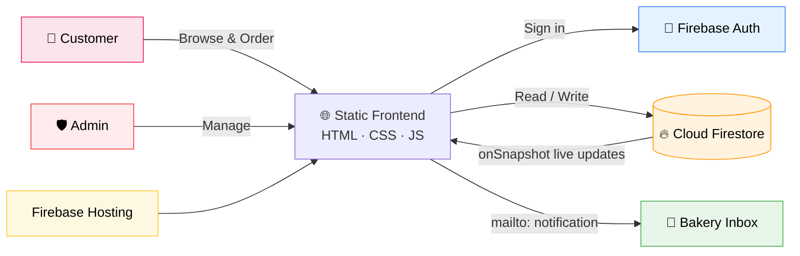

<div align="center">

# 🎂 Jiya's Cake

### Premium Digital Bakery & Ordering Platform

*Browse. Customize. Order. Track — all in one sweet experience.*

<br>


<br>

[](https://jiya-s-cake.web.app/)

<br>

[**🌐 Live Site**](https://jiya-s-cake.web.app/) &nbsp;•&nbsp; [**📂 Repository**](https://github.com/shivkoli07/Jiya-s-Cake-website) &nbsp;•&nbsp; [**📸 Instagram**](https://www.instagram.com/jiya_cake?stkn=emN5NGU2dHRhcWc0) &nbsp;•&nbsp; [**📍 Location**](https://maps.app.goo.gl/YQWTVbo8GhnuB9rR7)

</div>

---

## 📖 Overview

**Jiya's Cake** is a modern, fully responsive web application built for a boutique bakery. Customers get an immersive, video-rich catalog to explore cake designs, customize weight and messages, sign in securely with Firebase, pay via UPI, and follow their order in real time. Behind the scenes, a secure **Admin Dashboard** lets the bakery manage orders, revenue, and customer messages live.

<table>
<tr>
<td align="center" bgcolor="#FFF0F5"><b>🍰 Customers</b><br>Browse, customize & order</td>
<td align="center" bgcolor="#FFF8E1"><b>⚡ Real-Time</b><br>Live order tracking</td>
<td align="center" bgcolor="#E8F5E9"><b>🔐 Secure</b><br>Firebase Auth + Firestore Rules</td>
<td align="center" bgcolor="#E3F2FD"><b>🛡️ Admin</b><br>Live management dashboard</td>
</tr>
</table>

---

## ✨ Features

### 🍰 Interactive Cake Gallery


| Feature | Description |
|---|---|
| 🎬 **Video Loops** | Autoplaying video previews for every cake design |
| 🗂️ **Category Filters** | Birthday, Wedding, Anniversary & Premium — filter instantly |
| 🔎 **Live Search** | Real-time search by cake name or keyword |
| 🎨 **Customization Modal** | Choose weight (500 g, 1 Kg, 2 Kg, Custom) with dynamic pricing, add personalized messages and design/dietary notes |
| 🛍️ **Quick Add to Cart** | Local-storage-backed cart with animated success toasts |

### 🛒 Cart & Checkout


- 🧮 **Cart management** — adjust quantities, remove items, live price totals
- 📋 **Transparent order summary** with weight-based calculations
- 📲 **Scan & Pay** — UPI QR code for GPay, PhonePe, or Paytm
- 📧 **"I've Paid — Notify Us"** — opens a pre-filled `mailto:` with the full order breakdown and customer details

### 🔐 Authentication & Profiles


- 📝 **Email/Password** and one-click **Google Sign-In** (Firebase popup)
- 👤 **Persistent sessions** with a personalized user chip and logout
- 🗃️ **Firestore profiles** storing name, username, mobile, and delivery address

### 📦 Real-Time Order Tracking


```text
 Pending Confirmation  ➜  Confirmed  ➜  Preparing  ➜  Out for Delivery  ➜  Delivered
```

Cancellation notices are also displayed. Firestore rules guarantee customers only ever see **their own** orders.

### 🛡️ Admin Dashboard


| | |
|---|---|
| 🚪 **Secure Gateway** | Access limited to UIDs in the `admins` collection; others are signed out and redirected |
| ⚡ **Live Orders** | Instant updates through Firestore `onSnapshot` |
| 🔄 **Status Control** | Update order status from a dropdown — reflected instantly in the customer's tracker |
| 📊 **Live Metrics** | Total orders, pending confirmations, messages, and cumulative revenue |
| 📬 **Support Inbox** | Real-time view of Contact Us submissions |

### 💬 Customer Engagement


- 👩‍🍳 **About Us** — meet baker & owner **Shital Pramod Koli**, 100% pure vegetarian, freshly made cakes
- ❓ **FAQs** — 15+ answers on ingredients, delivery (5 KM local radius around Dhule), pick-up, and payments
- 📞 **Contact Us** — business location map link and a message form wired to Firestore
- ⭐ **Rate Us** — star ratings for taste and delivery, plus written reviews

---

## 🧱 Tech Stack

<table>
<tr>
<td bgcolor="#FFEBEE"><b>🎨 Frontend</b></td>
<td>HTML5 · CSS3 (Flexbox/Grid, Glassmorphism) · Vanilla JavaScript (ES6+)</td>
</tr>
<tr>
<td bgcolor="#FFF8E1"><b>🔥 Backend</b></td>
<td>Firebase v10.12.2 (Compat SDK) — Authentication & Cloud Firestore</td>
</tr>
<tr>
<td bgcolor="#E8F5E9"><b>🗄️ Collections</b></td>
<td><code>orders</code> · <code>users</code> · <code>admins</code> · <code>messages</code> · <code>ratings</code></td>
</tr>
<tr>
<td bgcolor="#E3F2FD"><b>🚀 Hosting</b></td>
<td>Firebase Hosting (static deployment)</td>
</tr>
<tr>
<td bgcolor="#F3E5F5"><b>🔤 Icons & Fonts</b></td>
<td>FontAwesome 6.7.1 · Google Fonts (Playfair Display, Poppins)</td>
</tr>
</table>

---

## 🏗️ Architecture



---

## 📁 Project Structure

```text
Jiya-s-Cake-website/
├── index.html            # Homepage — hero section, video showcases, auth state
├── gallery.html          # Cake catalog — search, filters, customization modal
├── cart.html             # Shopping cart & quantity management
├── order_details.html    # Checkout — UPI QR code & email trigger
├── order-history.html    # Real-time order tracker with step progress
├── login.html            # Customer sign-in
├── register.html         # Registration with validation
├── admin-login.html      # Administrator gateway
├── admin.html            # Admin dashboard — orders, stats, messages
├── About.html            # Baker bio & Instagram link
├── faqs.html             # Categorized accordion FAQs
├── Contact.html          # Contact details, map & inquiry form
└── rate-us.html          # Star ratings & feedback
```

---

## 🔒 Security & Firestore Rules

Access is separated between regular users, public contributors, and admins.

| Collection | Create | Read | Update | Delete |
|---|:---:|:---:|:---:|:---:|
| `users` | 👤 Owner | 👤 Owner | 👤 Owner | 👤 Owner |
| `admins` | ⛔ | 👤 Own record | ⛔ | ⛔ |
| `orders` | 🔑 Signed-in (own UID) | 👤 Owner · 🛡️ Admin | 🛡️ Admin | ⛔ |
| `messages` | 🌍 Anyone | 🛡️ Admin | — | 🛡️ Admin |
| `ratings` | 🌍 Anyone | 🛡️ Admin | — | 🛡️ Admin |

<details>
<summary><b>📜 View full <code>firestore.rules</code></b></summary>

```javascript
rules_version = '2';
service cloud.firestore {
  match /databases/{database}/documents {

    function isAdmin() {
      return request.auth != null &&
        exists(/databases/$(database)/documents/admins/$(request.auth.uid));
    }

    match /users/{userId} {
      allow read, write: if request.auth != null && request.auth.uid == userId;
    }

    match /admins/{adminId} {
      allow read: if request.auth != null && request.auth.uid == adminId;
      allow write: if false;
    }

    match /orders/{orderId} {
      allow create: if request.auth != null && request.resource.data.uid == request.auth.uid;
      allow read: if request.auth != null &&
        (resource.data.uid == request.auth.uid || isAdmin());
      allow update: if isAdmin();
      allow delete: if false;
    }

    match /messages/{messageId} {
      allow create: if true;
      allow read: if isAdmin();
      allow delete: if isAdmin();
    }

    match /ratings/{ratingId} {
      allow create: if true;
      allow read: if isAdmin();
      allow delete: if isAdmin();
    }
  }
}
```

</details>

---

## 🚀 Getting Started

> 🌐 **Want a quick look first?** Visit the deployed site: **[JIYA'S CAKE](https://jiya-s-cake.web.app/)**

### Prerequisites


### Run Locally

```bash
# 1. Clone the repository
git clone https://github.com/shivkoli07/Jiya-s-Cake-website.git

# 2. Enter the project folder
cd Jiya-s-Cake-website
```

3. Open the folder in **VS Code**.
4. Launch `index.html` with the **Live Server** extension.

### Deploy to Firebase

```bash
npm install -g firebase-tools
firebase login
firebase init hosting
firebase deploy
```
---

## 📞 Contact

| | |
|---|---|
| 🎂 **Bakery** | Jiya's Cake — Dhule |
| 🌐 **Live Site** | [jiya-s-cake.web.app](https://jiya-s-cake.web.app/) |
| 📸 **Instagram** | [@jiya_cake](https://www.instagram.com/jiya_cake?stkn=emN5NGU2dHRhcWc0) |
| 📍 **Map** | [Google Maps](https://maps.app.goo.gl/YQWTVbo8GhnuB9rR7) |

---

## 👨‍💻 Developer

<div align="center">

**Shiv Koli**

[](https://github.com/shivkoli07)
[](https://linkedin.com/in/shiv-koli-42516b355)

<br>

⭐ **If you like this project, give it a star on [GitHub](https://github.com/shivkoli07/Jiya-s-Cake-website)!** ⭐

*Made with 💖 and a lot of 🍰*

</div>
